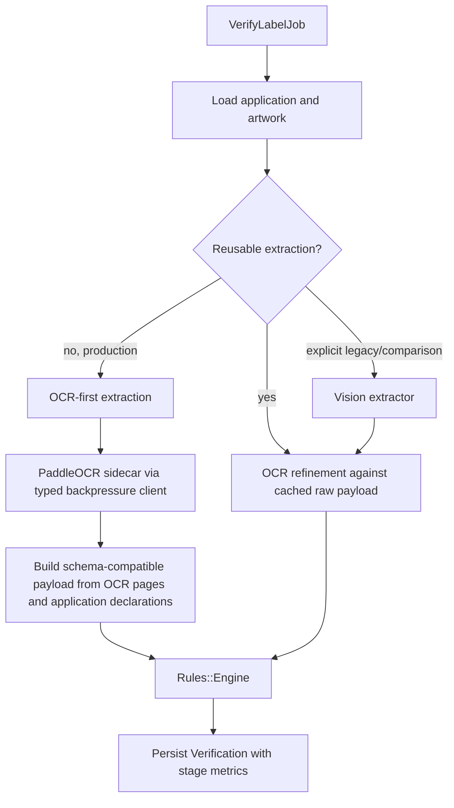

# Production Label Throughput and OCR Stability

## Summary

Make label verification fast by removing avoidable degradation under OCR load and moving cold production verification to an OCR-first path. The target is a real-record cold label in roughly five seconds when the OCR sidecar is already ready, with full timing artifacts and explicit failure modes when that target is not met.

---

## Problem Frame

The current changes proved that cached verification can be fast, but they did not prove that fresh labels are production-fast. The code still has a load bug: `ocr_service/app.py` returns HTTP 429 when the sidecar is busy, `app/lib/extraction/paddle_ocr_client.rb` converts that response into a generic `OcrError`, and `app/lib/extraction/fallback_ocr.rb` treats it as permission to use Tesseract. Under normal concurrent load, a healthy but saturated PaddleOCR service can silently degrade to the weaker fallback and produce poorer geometry.

The bigger latency issue is architectural. A cold label that waits on an 80-130 second multimodal extraction request cannot reach a five-second target by switching from MRI to JRuby, rewriting Rails in Java, or rewriting the sidecar in Go. The production path must stop depending on the full vision extraction call for every label and use local OCR plus deterministic field location as the critical path.

---

## Requirements

- R1. Sidecar busy responses must be treated as backpressure, not as OCR quality failures that trigger Tesseract fallback.
- R2. Verification must expose enough structured events to distinguish sidecar busy, sidecar failure, OCR fallback, OCR cache hit rate, extraction reuse, and cold-path stage timing.
- R3. The production cold path must run from local OCR and deterministic parsing before considering any external vision model call.
- R4. Vision extraction must remain available for explicit legacy/comparison runs and for future asynchronous enrichment, but it must not block the default production cold verdict.
- R5. Benchmarking must support real-record persisted runs that separately measure cold verification, cached verification, and direct sidecar OCR.
- R6. Concurrency configuration must align Rails job throughput with sidecar capacity so the default deployment does not overload the OCR worker.
- R7. Regression tests must cover the 429 path, fallback suppression on busy sidecar responses, OCR-first payload construction, benchmark mode selection, and sidecar admission control.
- R8. Local generated artifacts such as `ocr_service/.venv/` and Python bytecode must be ignored so production changes stay reviewable.
- R9. The production gate must include both timing and correctness: cold quality-mode verification should preserve the eval corpus signal, and the fast OCR attempt should hit roughly five seconds on the seeded real-record sample before it is trusted inside that quality gate.

---

## High-Level Technical Design

The fast path produces the same raw payload shape consumed by `Extraction::FactsMapper` and the UI. It uses the local OCR word pool, `Extraction::FieldReconciler`-style matching, existing parsing modules, and application declarations to fill fields that compliance rules need. Fields that require visual judgment, such as warning boldness, remain `nil` and naturally become `needs_review` where the rules cannot decide from text alone.

---

## Key Technical Decisions

- KTD1. Treat HTTP 429 as typed backpressure: `PaddleOcrClient` should retry according to `Retry-After`/configured backoff and then raise a non-`OcrError` extraction backpressure error so `FallbackOcr` cannot silently degrade to Tesseract.
- KTD2. Keep Ruby/Rails and the Python PaddleOCR sidecar: the measured bottlenecks are external model latency, native OCR/image work, and admission control; a language rewrite would not remove those costs.
- KTD3. Make OCR-first the production extractor: deterministic local extraction is the only path that can plausibly hit a five-second cold-label target on CPU.
- KTD4. Keep the full vision schema behind an explicit mode: it is useful for comparison and ambiguous cases, but its current prompt asks for text, page bases, boxes, arrays, and warning visual attributes in one expensive request.
- KTD5. Benchmark by mode instead of by anecdote: artifacts must name whether extraction reuse and OCR cache were allowed, because cached 2-3 second runs and true cold runs answer different questions.
- KTD6. Fail loud on overload: it is better for a verification job to retry from a typed backpressure error than to persist a lower-quality verdict created by an unintended fallback path.

---

## Implementation Units

### U1. OCR Backpressure Contract

- **Goal:** Convert sidecar 429 responses into a typed backpressure path that retries locally and never triggers Tesseract fallback.
- **Files:** `app/lib/extraction.rb`, `app/lib/extraction/paddle_ocr_client.rb`, `app/lib/extraction/fallback_ocr.rb`, `test/lib/extraction/paddle_ocr_client_test.rb`, `test/lib/extraction/fallback_ocr_test.rb`.
- **Approach:** Add an `Extraction::OcrBackpressureError` that inherits from `Extraction::ExtractionError` rather than `Extraction::OcrError`. Have `PaddleOcrClient` detect HTTP 429, honor `Retry-After` where present, emit a structured retry event, and raise `OcrBackpressureError` after attempts are exhausted. Let `VerifyLabelJob.retry_on Extraction::ExtractionError` own the final retry instead of falling back.
- **Test Scenarios:** A 429 followed by success returns PaddleOCR pages; repeated 429s raise `OcrBackpressureError`; `FallbackOcr` does not invoke the fallback engine for `OcrBackpressureError`; generic `OcrError` still falls back.
- **Verification:** Focused extraction tests pass and log instrumentation names are visible in benchmark artifacts.

### U2. Concurrency and Runtime Readiness Guardrails

- **Goal:** Make the default local/production configuration honest about capacity and prevent accidental 429 storms.
- **Files:** `config/initializers/extraction.rb`, `app/lib/extraction/runtime_dependencies.rb`, `app/lib/performance/ocr_sidecar_stress.rb`, `ocr_service/app.py`, `ocr_service/test_app.py`, `lib/tasks/perf.rake`.
- **Approach:** Surface sidecar concurrency and rejected-busy counters in runtime dependency output and performance artifacts. Add a Rails-side warning when `VERIFY_CONCURRENCY`/Solid Queue throughput materially exceeds `OCR_CONCURRENCY` without enough retry budget. Keep the sidecar bounded; do not raise `OCR_CONCURRENCY` by default unless a benchmark proves memory and p95 latency stay acceptable.
- **Test Scenarios:** Runtime dependency output includes sidecar capacity when PaddleOCR is configured; sidecar busy metrics remain covered by Python tests; benchmark artifacts capture busy counts when the sidecar reports them.
- **Verification:** `bin/rails perf:runtime_dependencies` gives an actionable capacity report before a benchmark run.

### U3. Real-Record Cold Benchmark Mode

- **Goal:** Produce persisted artifacts that answer whether a real cold label meets the target.
- **Files:** `app/lib/performance/verification_benchmark.rb`, `test/lib/performance/verification_benchmark_test.rb`, `lib/tasks/perf.rake`, `docs/solutions/performance-issues/label-processing-ocr-throughput-and-benchmarking.md`.
- **Approach:** Extend the benchmark with explicit modes for `cold`, `cached`, and `legacy_vision`. Cold mode disables extraction reuse and can bypass OCR cache without deleting existing rows. Every mode still persists a new `Verification` so timings match production write cost.
- **Test Scenarios:** Cold mode records `extraction_reused: false`; cached mode can hit reuse; artifacts include mode, cache policy, fallback count, backpressure count, and stage distributions.
- **Verification:** A seeded real-record run creates a JSON artifact whose summary can be compared against the five-second target.

### U4. OCR-First Payload Builder

- **Goal:** Build schema-compatible extraction payloads from local OCR pages without an external vision request.
- **Files:** `app/lib/extraction/ocr_first_payload.rb`, `app/lib/extraction/field_reconciler.rb`, `app/lib/extraction/facts_mapper.rb`, `test/lib/extraction/ocr_first_payload_test.rb`.
- **Approach:** Reuse the existing OCR page pool and matching primitives to fill declared fields, statement-shaped fields, alcohol statements, government warning text, disclosures, vintage, varietals, appellation, and page metadata. Preserve the existing raw JSON contract so `FactsMapper`, `Rules::Engine`, evidence overlays, and export code continue to work.
- **Test Scenarios:** Declared brand/net contents/class type are located with OCR boxes; alcohol and government warning statements are found from line text; missing visual warning attributes remain `nil`; output maps through `FactsMapper` and drives `Rules::Engine` without special cases.
- **Verification:** Focused unit tests cover the payload builder before it is wired into the job.

### U5. Wire Quality Mode Into Verification

- **Goal:** Make quality mode the default production path while retaining OCR-first and legacy vision extraction for explicit diagnostic/comparison runs.
- **Files:** `app/jobs/verify_label_job.rb`, `config/initializers/extraction.rb`, `test/jobs/verify_label_job_test.rb`, `test/lib/performance/verification_benchmark_test.rb`.
- **Approach:** Add an extraction mode setting with `quality` as the production default. Quality mode first builds a local OCR payload and evaluates it under `quality-v1`; if that attempt would persist a hard non-pass verdict, the job falls back to reusable or freshly extracted legacy vision before persisting. Explicit `ocr_first` mode remains available for speed diagnostics and records `ocr-first-v1`; explicit legacy mode keeps the current `extractor.extract` branch. Reuse lookups stay keyed by model id so OCR-first, quality, and vision payloads do not cross-contaminate.
- **Test Scenarios:** Default verification persists `quality-v1`; OCR hard failures fall back before persistence; explicit OCR-first avoids `vision_extraction`; legacy mode still calls the configured extractor; duplicate artwork reuse works within the same extraction mode.
- **Verification:** Job tests prove quality mode protects non-passing OCR attempts and that explicit OCR-first is opt-in.

### U6. Quality and Performance Gate

- **Goal:** Prove the new default is fast without hiding unacceptable verdict drift.
- **Files:** `lib/tasks/eval.rake`, `app/lib/eval_corpus/scorer.rb`, `app/lib/performance/verification_benchmark.rb`, `docs/solutions/performance-issues/label-processing-ocr-throughput-and-benchmarking.md`.
- **Approach:** Run the seeded real-record benchmark in cold quality mode, run the cached benchmark for comparison, and score existing parent/mutant eval records under the `quality-v1` model id. Record timing, fallback/backpressure counts, and eval summary together so speed and correctness are reviewed as one production gate. Run `ocr-first-v1` scoring separately when isolating the fast OCR attempt.
- **Test Scenarios:** Benchmark artifacts include enough mode metadata to connect a score run to the extraction mode; eval scoring can report the OCR-first model id without assuming a vision provider.
- **Verification:** The run summary states whether p50 cold latency is at or below five seconds, whether p95/max outliers exist, and whether eval scoring shows regressions that require tuning the fallback boundary.

### U7. Operational Cleanup and Documentation

- **Goal:** Leave future operators and agents with the correct mental model.
- **Files:** `.gitignore`, `docs/solutions/performance-issues/label-processing-ocr-throughput-and-benchmarking.md`, any new short code comments needed at boundaries.
- **Approach:** Ignore local Python environments and bytecode. Update the solution note with the corrected backpressure behavior, the definition of cold-label benchmarking, the quality-mode production path, and the remaining cases where vision is intentionally required.
- **Test Scenarios:** Repository status no longer includes local sidecar environment files; documentation references current behavior rather than the intermediate fallback bug.
- **Verification:** `git status --short` is reviewable after tests and benchmark artifacts are generated.

---

## Acceptance Examples

- AE1. Given `OCR_CONCURRENCY=1` and two simultaneous reads, when one read receives 429 and later succeeds, then the verification uses PaddleOCR output and does not emit an OCR fallback event.
- AE2. Given the sidecar stays busy past the retry budget, when a verification asks for OCR, then the job retries from `Extraction::OcrBackpressureError` and does not persist a Tesseract-backed degraded verification.
- AE3. Given a seeded real label with no extraction reuse and no OCR cache hit, when `perf:verify_labels` runs in cold OCR-first mode, then the artifact records persisted verification timing with `vision_extraction` absent and OCR/rules stages present.
- AE4. Given an operator explicitly runs legacy vision mode, when the same benchmark executes, then the artifact names the mode and still includes the `vision_extraction` stage for comparison.
- AE5. Given local sidecar artifacts exist, when repository status is checked, then `.venv` and `__pycache__` do not appear as production code changes.

---

## Scope Boundaries

- This plan does not rewrite Rails, replace MRI, migrate the sidecar to Java/Go, or switch to JRuby. Those are not justified before removing the external vision call from the cold path.
- This plan does not promise five seconds for process startup plus first PaddleOCR model load. Production readiness requires the sidecar to be started and ready before accepting verification work.
- This plan does not remove the vision extractors. They remain available for explicit comparison runs and future asynchronous enrichment.
- This plan does not tune GPU deployment. CPU performance must be stable first; GPU can be a later capacity multiplier.

---

## System-Wide Impact

The default extraction model id changes for new production verifications, so extraction reuse remains isolated by mode. The verifier may use fast OCR for clean cases, but quality mode must fall back before persisting hard non-pass OCR verdicts. OCR-first remains acceptable only as an internal attempt or explicit diagnostic mode, not as the production quality contract.

The sidecar contract becomes stricter: overload is a retryable operational condition, not a data-quality fallback. This affects job retries, benchmark interpretation, and operations dashboards.

---

## Risks and Dependencies

- **OCR recall risk:** OCR-first may miss field text that the vision model previously inferred. Mitigation: keep raw OCR pages, field-level provenance, and comparison benchmarks against legacy vision mode.
- **Verdict drift risk:** Deterministic extraction can change pass/fail/needs-review distribution. Mitigation: run the seeded analysis before and after wiring OCR-first, then inspect changed findings before declaring production readiness.
- **Backpressure retry cost:** Failing loud may delay a job instead of completing with fallback. Mitigation: tune concurrency and retry budget from sidecar metrics, not guesswork.
- **Five-second target risk:** Some large images still take longer than five seconds on CPU OCR. Mitigation: keep image size bounded, report p50/p95/max in artifacts, and identify labels that exceed target by input dimensions and OCR stage.

---

## Documentation and Operational Notes

Cold benchmark means no prior extraction reuse and no OCR cache hit for the selected artwork while the sidecar is already ready. Sidecar process startup and PaddleOCR model load are a deployment readiness concern, not a per-label SLA.

The production runbook should start with runtime dependencies, sidecar metrics, and benchmark artifacts. If latency regresses, check `vision_extraction` presence, OCR cache hit rate, OCR backpressure count, OCR fallback count, and per-stage p95 before discussing runtime rewrites.

---

## Sources and Research

| Source | Finding |
| --- | --- |
| `app/lib/extraction/paddle_ocr_client.rb` | Non-success HTTP responses currently become generic `OcrError`, including 429 busy responses. |
| `app/lib/extraction/fallback_ocr.rb` | Every `OcrError` currently triggers fallback and marks the engine degraded. |
| `ocr_service/app.py` | Sidecar admission is bounded by `OCR_CONCURRENCY`, returns 429 with `Retry-After`, and exposes `/metrics`. |
| `app/jobs/verify_label_job.rb` | Default verification still calls the vision extractor when extraction reuse misses. |
| `app/lib/extraction/schema.rb` | The vision schema asks for text, boxes, page dimensions, arrays, and visual warning attributes in one request. |
| `app/lib/extraction/field_reconciler.rb` | Existing code already locates declared application values inside OCR word pools. |
| `app/lib/performance/verification_benchmark.rb` | Current artifacts measure real persisted records but do not yet distinguish true cold mode from cached/reused mode. |
| `docs/solutions/performance-issues/label-processing-ocr-throughput-and-benchmarking.md` | Prior clean run showed direct PaddleOCR p50 around 3.7 seconds and cached verification around 2.9 seconds for 14 seeded labels. |
