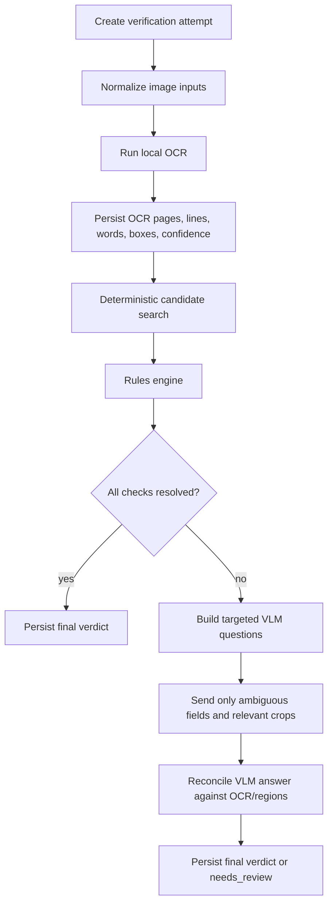

# Evidence-First Verifier V2

## Purpose

The purpose of this site is to verify label applications quickly, reliably, and with evidence a human reviewer can trust.

The product is not an OCR demo, a VLM demo, or a prompt experiment. It is a compliance review tool. Every engineering decision has to serve that purpose.

## Current Failure Pattern

The current pipeline has repeatedly failed in the same broad way:

- Reviews can fail before a persisted verification record exists.
- Queue wait, OCR time, VLM time, and hard job errors are hard to distinguish from the UI.
- OCR misses or bad model reads can be persisted as authoritative compliance failures.
- VLM responses can invent or normalize label text that is not actually on the label.
- Large schemas and all-in-one prompts create provider errors, high latency, and brittle output.
- Sidecar instability or backpressure can look like low-quality label evidence.
- A failed or slow backend can make the app appear inert, which defeats the site's core purpose.

The conclusion is not that Rails must be rewritten. Rails is doing ordinary orchestration, persistence, UI, and review workflow work. The failing area is the verifier core: evidence acquisition, evidence grounding, rules evaluation, state persistence, and observability.

## Problem Class

This is a visual document evidence retrieval problem followed by deterministic regulatory evaluation.

The system must answer questions such as:

- Does the application value appear on the label?
- Where does it appear?
- Is the observed label text close enough to the application value?
- Does the label contain a required statutory statement?
- Is a missing or mismatched value a true compliance problem or an evidence-quality uncertainty?

That means the system needs grounded evidence. A model answer without a supporting text span, region, or uncertainty state is not sufficient.

## Architecture Decision

Keep the Rails application. Replace the verifier core with an evidence-first `VerifierV2`.

`VerifierV2` should own the full verification attempt lifecycle:

```text
queued -> processing -> passed | failed | needs_review | error
```

A review must never silently disappear. The system should persist an attempt before doing expensive work, update stage timings as work completes, and persist explicit operational errors when a backend fails.

## Design Principles

1. Evidence before judgment.
   A failed check must cite observed OCR text, an image region, or say that evidence is insufficient.

2. OCR is the primary text evidence layer.
   OCR output should include words, lines, confidence, page dimensions, and bounding boxes. Plain text alone is not enough.

3. VLMs are adjudicators, not the source of truth.
   The model can help decide ambiguous cases from image crops and OCR candidates, but it must not be allowed to fabricate label text.

4. Rules are deterministic.
   The rules engine should compare application data against grounded evidence. It should not ask the model to decide regulatory compliance wholesale.

5. Unknown is a valid production result.
   If evidence is weak, mark `needs_review`; do not turn uncertainty into `failed`.

6. Operational failures are not label failures.
   OCR timeouts, API errors, sidecar failures, malformed model responses, and provider schema errors should produce `error`, not compliance failures.

7. Latency is a product requirement.
   A normal cold label should target five seconds. Ambiguous labels should target ten seconds. Pathological labels should stop with `needs_review` or `error`, not run indefinitely.

## Recommended Pipeline



## OCR Strategy

Use local Tesseract as the first production OCR baseline because it is local, process-based, easy to supervise from Rails, and can emit TSV or hOCR with word boxes and confidence.

The first pass should:

- Normalize image encoding and strip alpha.
- Bound image dimensions before OCR.
- Run Tesseract with TSV output.
- Parse word, line, block, confidence, and bounding box data.
- Force OCR strings into valid UTF-8 before normalization.
- Persist OCR artifacts for reuse, debugging, and evidence overlays.

Escalation passes should run only when needed:

- Rotate `90`, `180`, and `270` degrees when the first pass misses required text.
- Try relevant page segmentation modes for dense labels, sparse labels, small crops, and single-line crops.
- Use binarization or contrast normalization for dark backgrounds or low-contrast small type.
- Crop candidate regions for field-specific OCR when full-image OCR is weak.

Do not run every preprocessing strategy on every label. That guarantees missed latency targets.

## VLM Strategy

Use a small, fast VLM only for unresolved fields.

The VLM input should include:

- The specific application field and expected value.
- OCR candidate strings and coordinates.
- One or more cropped image regions, not the entire label by default.
- A small schema for one task, not the full regulatory universe.

The VLM output should be constrained to:

```json
{
  "status": "present | absent | ambiguous",
  "observed_text": "string",
  "evidence": {
    "source": "ocr | image_region | visual_only",
    "page": 1,
    "bbox": [0, 0, 0, 0]
  },
  "reason": "string"
}
```

The reconciliation layer must reject unsupported claims:

- If the model claims exact text that does not appear in OCR and no image region supports it, mark `ambiguous`.
- If the model paraphrases statutory text instead of reading it, mark `ambiguous`.
- If the model finds a value on a wrong side, neck label, unrelated panel, or duplicate artwork, mark `needs_review`.

## Rules Strategy

Rules should consume structured evidence, not raw model prose.

Each check should return:

- `pass`
- `pass_with_note`
- `needs_review`
- `fail`
- `not_applicable`

Each result should include:

- Application value.
- Observed label value.
- Evidence source.
- Confidence or match quality.
- Regulatory citation.
- Reviewer-facing explanation.

Hard `fail` should be reserved for cases with strong grounded evidence. Weak OCR, missing crop evidence, or model uncertainty should become `needs_review`.

## Known Domain Edge Cases

Government warning:

- The statutory text can be wrapped across lines.
- Hyphenated line breaks can split words such as `preg-nancy`.
- Some labels omit spaces at line boundaries.
- Some warnings are rotated.
- The requirement for a continuous paragraph should not fail merely because OCR inserted line breaks.
- The system should normalize line wrapping and hyphenation before wording comparison.
- Visual layout should still be available for reviewer judgment when paragraph continuity is uncertain.

Alcohol content:

- Product class matters. A vodka seltzer is not the same compliance case as straight vodka.
- The designation/class rules must not infer a 40 percent ABV floor from a phrase that includes `vodka seltzer`.
- ABV matching should tolerate `ALC/VOL`, `ABV`, spacing, casing, and punctuation variants.

Fanciful name:

- Flavor names and product names may appear as separate lines.
- The label can contain a short flavor display while the application contains a longer composite name.
- This should often be `pass_with_note` or `needs_review`, not automatic failure.

Name and address:

- Exact word-for-word address matching is unrealistic.
- Compare applicant/importer/producer/bottler identity and meaningful location tokens.
- Missing legal entity names can be real failures, but harmless formatting differences should not be.

Front/back/neck labels:

- Artwork role detection must be explicit.
- Do not assume the first uploaded image is the front label.
- If an image appears to be back or neck-only, associate it to the application as supporting artwork and reflect that in evidence.
- If the system cannot determine artwork role, mark fields that depend on role as `needs_review`.

## Latency Budget

Target cold path:

| Stage | Target |
| --- | ---: |
| Create attempt | < 100 ms |
| Image normalization | 200-800 ms |
| Primary OCR | 500-2000 ms |
| Candidate matching | < 200 ms |
| Rules evaluation | < 200 ms |
| Targeted VLM adjudication | 2000-6000 ms only when needed |

Expected outcomes:

- Easy labels: 1-3 seconds.
- Ambiguous labels: 4-8 seconds.
- Hard labels: `needs_review` or `error` by roughly 10 seconds.

The system should report queue wait separately from processing time. A ten-second processing target is meaningless if the job waits two minutes before it starts.

## Observability Requirements

Each verification attempt should persist or emit:

- Attempt id.
- Application id.
- Artwork fingerprints.
- Queue wait duration.
- Total processing duration.
- Image normalization duration.
- OCR duration by pass.
- OCR engine and version.
- OCR word count and average confidence.
- Cache hit or miss.
- VLM provider, model, duration, token usage, and schema version.
- Rules duration.
- Final verdict.
- Error class, message, and backend response body for operational failures.

The UI should show whether a record is queued, processing, completed, or errored. It should not require reading logs to know whether work is happening.

## Evaluation Harness

Every user-discovered failure should become a fixture.

Minimum corpus categories:

- Rotated government warning.
- Wrapped government warning.
- Hyphenated statutory words.
- Dense back label.
- Neck label only.
- Front/back swapped.
- Vodka seltzer versus vodka designation.
- Low-contrast white-on-dark text.
- Small net contents.
- Flavor-only fanciful name.
- Address close match.
- Label with known OCR hallucination risk.

Each fixture should define expected outcomes for important fields:

```yaml
serial_number: "example"
expected:
  government_warning_text: pass
  government_warning_paragraph: needs_review
  alcohol_content: pass
  fanciful_name: pass_with_note
  name_address: pass_with_note
```

The regression suite should measure both correctness and latency. A fast wrong verifier is not production-ready.

## Non-Goals

- Do not rewrite the whole Rails app before replacing the verifier core.
- Do not make the VLM responsible for full regulatory compliance.
- Do not use a giant all-in-one schema for every label.
- Do not persist model-invented text as if it were observed label text.
- Do not treat operational backend failures as label compliance failures.
- Do not run expensive OCR escalation passes on every image by default.
- Do not optimize only cached runs and call the cold path solved.
- Do not declare production readiness without a regression corpus.

## Implementation Sequence

1. Stabilize attempt persistence.
   Create a verification attempt before processing and guarantee final state persistence for success, review, failure, or operational error.

2. Build the OCR evidence store.
   Tesseract TSV parser, UTF-8 normalization, OCR artifact persistence, and cache keyed by artwork fingerprint and OCR config.

3. Build deterministic field search.
   Candidate matching for alcohol content, net contents, brand, fanciful name, varietals, class/type, country, warning, and name/address.

4. Harden rules around evidence quality.
   Convert uncertain evidence into `needs_review`; reserve hard failures for strongly grounded evidence.

5. Add targeted VLM adjudication.
   Use small schemas and image crops only for unresolved fields.

6. Add live progress visibility.
   Show queue, processing, OCR, VLM, rules, and final state in the UI.

7. Build the regression corpus.
   Convert current screenshots and seeded labels into tests before tuning thresholds.

8. Run cold benchmarks.
   Report queue wait, processing time, stage timings, p50, p95, max, and verdict drift.

## Resume Point

The next engineering pass should not continue patching the old verifier incrementally. Start by introducing `VerifierV2` behind a narrow interface while leaving the existing UI and records intact.

Suggested first contract:

```ruby
VerifierV2.call(application_id:)
```

The call should immediately persist an attempt, run local OCR, evaluate deterministic evidence, and persist a final state. VLM adjudication can come after the attempt lifecycle and OCR evidence store are reliable.

The first acceptance test should prove this:

```text
Given a label application with artwork,
when VerifierV2 starts,
then a verification attempt is persisted before OCR,
and the attempt ends in passed, failed, needs_review, or error,
and stage timings are recorded.
```

## Research Notes

- Tesseract supports TSV and hOCR output with word-level bounding boxes and confidence, which makes it suitable as a local evidence layer: [Tesseract command line usage](https://tesseract-ocr.github.io/tessdoc/Command-Line-Usage.html).
- Tesseract quality depends heavily on image preprocessing, DPI, binarization, deskewing, borders, and page segmentation mode: [Tesseract quality guide](https://tesseract-ocr.github.io/tessdoc/ImproveQuality.html).
- OpenAI structured outputs help enforce response shape, but schema complexity has practical limits and does not make model-observed text trustworthy by itself: [OpenAI structured outputs](https://developers.openai.com/api/docs/guides/structured-outputs).
- OpenAI vision detail modes affect cost and latency; low detail is faster and cheaper when fine visual detail is not needed, while high/original modes are for dense spatial tasks: [OpenAI images and vision](https://developers.openai.com/api/docs/guides/images-vision).
- OpenAI latency guidance favors smaller models, fewer input tokens, fewer generated tokens, fewer requests, and parallelism where possible: [OpenAI latency optimization](https://developers.openai.com/api/docs/guides/latency-optimization).
- Anthropic tool use and strict tool use can constrain output shape, but tools add tokens and schema overhead; this supports small task-specific schemas rather than one huge regulatory schema: [Anthropic tool use](https://platform.claude.com/docs/en/agents-and-tools/tool-use/overview).
- AWS Textract can return line and word blocks with geometry and is synchronous for simple document text detection, but it adds network latency, credentials, quotas, and provider dependency: [AWS Textract DetectDocumentText](https://docs.aws.amazon.com/textract/latest/APIReference/API_DetectDocumentText.html).
- Google Vision OCR returns full text, individual words, and bounding boxes; it is a viable external comparison or fallback service, not the fastest local baseline: [Google Vision OCR](https://docs.cloud.google.com/vision/docs/ocr).
- PaddleOCR remains technically strong, but a sidecar must be supervised, health-checked, benchmarked, and isolated from compliance verdicts when it is unavailable or overloaded: [PaddleOCR](https://github.com/PaddlePaddle/PaddleOCR).
- Recent document/VLM research highlights OCR hallucination and fine-grained visual document limitations, which matches the observed failures when the model claimed label text that was not actually present: [Seeing is Believing?](https://arxiv.org/abs/2506.20168), [ReViCo](https://arxiv.org/abs/2509.17418), [MMDocBench](https://arxiv.org/abs/2410.21311).
