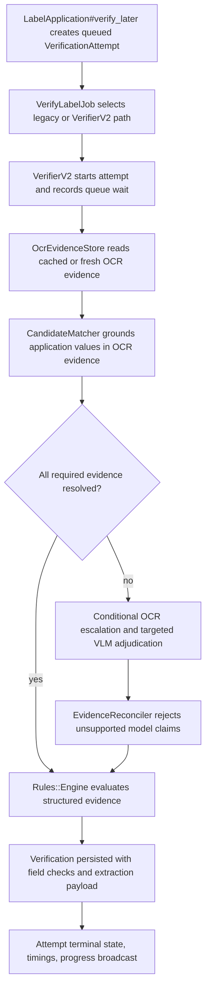
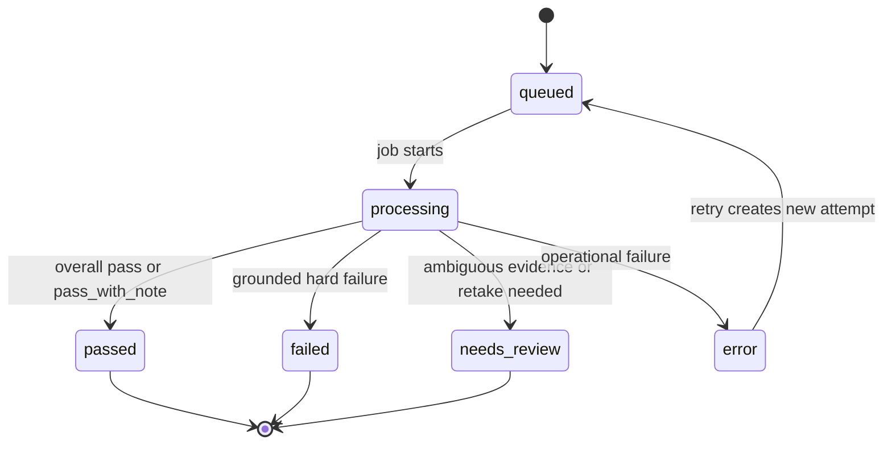

# feat: Complete Evidence-First Verifier V2

## Summary

Complete the remaining Taskmaster backlog by turning the current Rails verifier into an evidence-first pipeline: OCR evidence is acquired and cached once, application values are matched deterministically, VLMs adjudicate only unresolved fields, rules consume structured evidence, and every attempt is observable from queue admission through final verdict.

The implementation should preserve the existing Rails product shell and current records while introducing `VerifierV2` behind a narrow interface and feature flag. Speed is necessary but not sufficient: the launch gate is cold-path timing plus regression-corpus correctness.

---

## Problem Frame

The app's core purpose is label verification that is fast, stable, and trustworthy. Prior work improved cache-path speed and added the `VerificationAttempt` lifecycle, but the verifier still mixes OCR reads, model claims, rule verdicts, UI progress, and operational failures too tightly. That lets weak evidence become hard failures, provider errors look like label problems, and cold-label performance claims drift from reality.

The remaining Taskmaster tasks all point at the same product repair: make evidence a first-class contract before judgment. The current codebase already has useful pieces (`OcrPagePool`, `OcrCache`, `BboxGrounder`, `FieldReconciler`, `VlmReconciler`, `RuntimeDependencies`, `Rules::Engine`, and spotlight UI), so the work should deepen and integrate those pieces rather than replace them wholesale.

---

## Requirements

**Evidence and judgment**

- R1. Persist and update a `VerificationAttempt` for every run, including queue wait, processing timestamps, stage timings, final state, and operational error context.
- R2. Build a reusable OCR evidence layer that returns pages, lines, words, confidence, geometry, engine metadata, cache status, and valid UTF-8 text.
- R3. Locate application values in OCR evidence with deterministic fuzzy matching that tolerates casing, punctuation, spacing, diacritics, hyphenated line breaks, multi-line warnings, and rotated text when escalation runs.
- R4. Reject unsupported VLM text claims unless they are grounded by OCR evidence or a valid image region; unsupported claims become ambiguous evidence.
- R5. Make rules evaluate structured evidence quality so weak, missing, or ambiguous evidence becomes `needs_review`, while hard `fail` is reserved for high-confidence grounded mismatches.
- R6. Add targeted VLM adjudication for unresolved fields with small schemas, crops when available, a bounded field count, and provider failures that demote fields to ambiguous rather than corrupting the attempt.
- R7. Handle vodka seltzer and similar product-class edge cases without applying straight-vodka ABV thresholds to malt or seltzer products.

**Orchestration and operations**

- R8. Introduce `VerifierV2` as the single orchestration entry point for OCR, matching, adjudication, reconciliation, rules, persistence, and attempt state transitions.
- R9. Migrate `VerifyLabelJob` to call `VerifierV2` behind `USE_VERIFIER_V2`, preserving the legacy path during rollout and keeping extraction reuse semantics explicit.
- R10. Keep OCR backpressure, timeouts, sidecar outages, and provider schema errors as operational states, never as compliance findings.
- R11. Record p50, p95, max, failure counts, queue wait, cold/cache mode, cache hit rate, OCR/VLM/rules timings, fallback count, and backpressure count in performance artifacts.
- R12. Align verification concurrency with OCR capacity by default and process batch attempts with bounded parallelism.

**Batch and review experience**

- R13. Validate batch CSVs and image references before processing, returning structured row/column/image errors and creating no partial batch on invalid input.
- R14. Gate batch work on OCR readiness, surface readiness failures clearly, and allow retry of operational failures without reimporting successful rows.
- R15. Broadcast attempt and stage progress through the reviewer queue and batch pages so users can see queued, processing, completed, review, failure, and error states in near real time.
- R16. Merge review and detail pages into one inspection surface with application values, field findings, evidence, and reviewer actions.
- R17. Use spotlight-style evidence highlighting by default so overlays do not obscure label text, while preserving graceful fallback for missing or invalid boxes.
- R18. Build a fixture-backed review corpus for known regressions and report both correctness and latency.

---

## Key Technical Decisions

- KTD1. Keep Rails as the product shell and put `VerifierV2` behind a deep-module boundary. Rails already owns persistence, Active Storage, Solid Queue, Turbo, and review workflows; the unstable part is the verifier core, not the runtime.
- KTD2. Adapt existing OCR primitives instead of replacing them. `OcrPagePool`, `OcrCache`, `OcrClient`, `PaddleOcrClient`, and `OcrGateway` already encode important sidecar and cache lessons; `OcrEvidenceStore` should wrap and enrich them.
- KTD3. Extend evidence structures compatibly. `LabelFacts`, `FieldCheck`, extraction payloads, and review helpers must continue reading old verification JSON while exposing source, confidence, page, bbox, and ambiguity for V2 records.
- KTD4. Extract matching behavior from `BboxGrounder` and `FieldReconciler`. Reusing their tokenization and geometry behavior lowers regression risk compared with inventing a parallel fuzzy matcher.
- KTD5. Treat VLMs as adjudicators, not text authorities. Use `gpt-5.4-mini` as the initial small/fast OpenAI adjudication model target, with field-specific schemas because the prior large-schema approach hit provider grammar limits and amplified latency.
- KTD6. Keep operational failures typed and visible. `OcrBackpressureError` must not inherit from `OcrError`, batch OCR must not silently fall through to weaker evidence, and unavailable OCR must block or error rather than create false findings.
- KTD7. Wire batch progress from attempt state, not ad hoc counters. Attempts are the durable unit that can explain queue wait, retry state, processing state, and final outcome.
- KTD8. Land backend evidence contracts before UI consolidation. The combined review/detail page should display trustworthy evidence, not mask unresolved verifier quality problems.

---

## High-Level Technical Design

---

## Implementation Units

### U1. Stabilize Current Contracts Before V2

- **Goal:** Reconcile current code with the performance and PRD assumptions so later units do not build on mismatched APIs.
- **Requirements:** R1, R9, R10, R12, R14
- **Dependencies:** Task #1 is complete.
- **Files:** `config/initializers/extraction.rb`, `Procfile.dev`, `app/models/label_application.rb`, `app/models/batch.rb`, `app/controllers/batches_controller.rb`, `app/controllers/batches/retries_controller.rb`, `app/jobs/verify_label_job.rb`, `test/models/label_application_test.rb`, `test/models/batch_test.rb`, `test/controllers/batches_controller_test.rb`, `test/jobs/verify_label_job_test.rb`
- **Approach:** Add the missing extraction config keys referenced by current code, align default verification concurrency with OCR capacity, and restore any documented model verbs that current code does not yet support. Keep existing behavior available and do not remove the legacy job pipeline in this unit.
- **Execution note:** Add characterization tests around existing job enqueue arguments, batch retry behavior, readiness gating, and old extraction payload compatibility before changing signatures.
- **Patterns to follow:** Model-owned workflow verbs in `LabelApplication#verify_later` and `Batch#retry_failed_verifications_later`; structured runtime reporting in `Extraction::RuntimeDependencies`.
- **Test scenarios:**
  - Creating or rechecking a label creates a queued attempt and enqueues `VerifyLabelJob` with the attempt id and optional mode.
  - Batch retry creates new attempts only for unchecked or error records.
  - Default verification concurrency uses `OCR_CONCURRENCY` when `VERIFY_CONCURRENCY` is not set.
  - OCR readiness failure prevents batch enqueueing and returns a visible validation message.
  - Existing legacy verification records still render and load.
- **Verification:** Current tests still pass, and Taskmaster tasks depending on a stable admission contract can safely start.

### U2. Build OCR Evidence Store and Candidate Matcher

- **Goal:** Create the first-class local evidence layer and deterministic matcher that downstream rules can trust.
- **Requirements:** R2, R3, R10, R14
- **Dependencies:** U1
- **Files:** `app/lib/extraction/ocr_evidence.rb`, `app/lib/extraction/ocr_evidence_store.rb`, `app/lib/extraction/candidate_matcher.rb`, `app/lib/extraction/ocr_escalation.rb`, `app/lib/extraction/ocr_cache.rb`, `app/lib/extraction/ocr_client.rb`, `app/lib/extraction/paddle_ocr_client.rb`, `app/lib/extraction/ocr_factory.rb`, `app/lib/extraction/runtime_dependencies.rb`, `app/models/ocr_reading.rb`, `test/lib/extraction/ocr_evidence_store_test.rb`, `test/lib/extraction/candidate_matcher_test.rb`, `test/lib/extraction/ocr_escalation_test.rb`, `test/lib/extraction/ocr_cache_test.rb`, `test/lib/extraction/runtime_dependencies_test.rb`
- **Approach:** Introduce immutable `Data.define` values for OCR evidence pages, lines, words, and candidates. Preserve existing word-only callers by adapting `OcrClient::Page` data into richer evidence objects. Cache evidence by artwork checksum plus engine/config key, and bump cache keys when OCR output shape changes. Add conditional escalation for rotation, contrast/binarization, and region crops only when missing evidence and latency budget permit it.
- **Patterns to follow:** `Extraction::OcrPagePool.read`, `Extraction::OcrCache.read_through`, `Extraction::BboxGrounder`, `Extraction::FieldReconciler`.
- **Test scenarios:**
  - OCR TSV with page, line, word, bbox, and confidence parses into valid evidence.
  - Binary or invalid UTF-8 OCR text is converted without crashing normalization.
  - Empty pages and zero-confidence words remain represented but do not become strong evidence.
  - Cache hit returns the same evidence without calling the engine.
  - Exact, fuzzy, punctuation-only, diacritic, hyphenated, multi-line, and wrapped-warning matches produce ranked candidates.
  - A 500+ word page matches within the performance budget.
  - Missing warning evidence with low confidence and remaining budget triggers rotation escalation.
  - OCR timeout or sidecar backpressure raises a typed operational error.
- **Verification:** OCR evidence and matching can be tested without the Rails UI or VLM providers.

### U3. Introduce Structured Evidence and Harden Rules

- **Goal:** Make the rules engine consume evidence quality, not raw model prose.
- **Requirements:** R4, R5, R7, R10
- **Dependencies:** U2
- **Files:** `app/lib/extraction/label_facts.rb`, `app/lib/extraction/facts_mapper.rb`, `app/lib/extraction/evidence_reconciler.rb`, `app/lib/extraction/vlm_reconciler.rb`, `app/models/field_check.rb`, `app/lib/rules/engine.rb`, `app/lib/rules/checks/alcohol.rb`, `app/lib/rules/checks/designation.rb`, `app/lib/rules/checks/disclosures.rb`, `app/lib/rules/checks/identity.rb`, `app/lib/rules/checks/net_contents_check.rb`, `app/lib/rules/checks/spirits_rules.rb`, `app/lib/rules/checks/warning.rb`, `app/lib/rules/checks/wine_rules.rb`, `test/models/field_check_test.rb`, `test/lib/extraction/facts_mapper_test.rb`, `test/lib/extraction/vlm_reconciler_test.rb`, `test/lib/rules/engine_test.rb`, `test/lib/rules/identity_test.rb`
- **Approach:** Extend fact fields with source, confidence, page, bbox, and ambiguity while keeping legacy payloads readable. Reconcile VLM fields against OCR candidates and valid regions before rules see them. Add helper predicates so each rule can distinguish high-confidence match, high-confidence mismatch, weak evidence, missing evidence, not applicable, and close-enough notes.
- **Patterns to follow:** `FieldCheck.from_h` compatibility, `Rules::Engine.evaluate` pure evaluation, current `Parsing::WarningComparator` and `Parsing::NameAddress` normalizers.
- **Test scenarios:**
  - A VLM field matching OCR is accepted with grounded source and bbox.
  - A VLM field absent from OCR and unsupported by region is marked ambiguous.
  - A warning paraphrase or hallucinated text cannot produce an automated pass or fail.
  - High-confidence mismatches produce `fail`.
  - Low-confidence or ambiguous evidence produces `needs_review`.
  - Government warning comparison tolerates wrapping, missing inter-line spaces, and hyphenated line breaks.
  - Name/address close matches produce `pass_with_note` or `needs_review` instead of automatic failure.
  - Vodka seltzer malt-style records do not inherit straight-vodka ABV thresholds, while straight vodka still does.
- **Verification:** Known false failures move from hard `fail` to `needs_review` or `pass_with_note` unless evidence is strong.

### U4. Add Targeted VLM Adjudication

- **Goal:** Use a small, fast model only when OCR and deterministic matching cannot resolve a field.
- **Requirements:** R4, R6, R10
- **Dependencies:** U3
- **Files:** `app/lib/extraction/vlm_adjudicator.rb`, `app/lib/extraction/schema.rb`, `app/lib/extraction/regulatory_evidence_schema.rb`, `app/services/label_extractor.rb`, `app/services/openai_label_extractor.rb`, `app/lib/extraction/anthropic_client.rb`, `app/lib/extraction/openai_client.rb`, `test/lib/extraction/vlm_adjudicator_test.rb`, `test/services/label_extractor_test.rb`, `test/services/openai_label_extractor_test.rb`
- **Approach:** Build per-field requests with expected application value, candidate OCR evidence, and focused crops when available. Use `gpt-5.4-mini` as the default OpenAI adjudication model unless an explicit model override is supplied. Keep each schema to status, observed text, optional bbox, source, and reason. Cap adjudicated fields and total stage duration. Provider schema errors, timeouts, and rate limits should demote unresolved fields to ambiguous unless the whole provider call is configured as required.
- **Patterns to follow:** Existing provider factory seams and the regulatory-evidence mapper, but avoid the previous all-in-one schema shape.
- **Test scenarios:**
  - A focused request for one field includes expected value and candidate evidence but not unrelated regulatory schema.
  - `present`, `absent`, and `ambiguous` responses parse into structured adjudication results.
  - A model bbox outside the crop or page bounds is rejected.
  - Provider timeout returns ambiguous evidence for that field.
  - More than the configured maximum unresolved fields does not create extra VLM calls.
  - A schema that would exceed provider constraints is not generated.
  - The default OpenAI adjudicator uses `gpt-5.4-mini` and still allows an explicit model override for comparison runs.
- **Verification:** VLM output cannot become persisted observed text without reconciliation from U3.

### U5. Create VerifierV2 and Migrate VerifyLabelJob

- **Goal:** Move verification orchestration out of `VerifyLabelJob` and into a narrow, observable V2 interface.
- **Requirements:** R1, R8, R9, R10, R11
- **Dependencies:** U2, U3, U4
- **Files:** `app/lib/verifier_v2.rb`, `app/lib/verifier_v2/progress_reporter.rb`, `app/lib/verifier_v2/stage_timer.rb`, `app/jobs/verify_label_job.rb`, `app/models/verification_attempt.rb`, `app/models/verification.rb`, `app/lib/performance/verification_benchmark.rb`, `lib/tasks/perf.rake`, `lib/tasks/verifier.rake`, `test/lib/verifier_v2_test.rb`, `test/jobs/verify_label_job_test.rb`, `test/lib/performance/verification_benchmark_test.rb`
- **Approach:** Add `VerifierV2.verify(label_application:, attempt:)` and make it own attempt transitions, stage timing, evidence acquisition, matching, escalation, adjudication, reconciliation, rule evaluation, verification persistence, and terminal state mapping. `VerifyLabelJob` chooses V2 only when enabled and otherwise preserves the legacy quality path. Persist timing breakdowns to the attempt, emit structured logs, and add a performance report over attempts and benchmark artifacts.
- **Patterns to follow:** `VerifyLabelJob#measure_stage`, `VerificationAttempt#finish_with!`, `Verification.completed.with_extraction`, `Performance::VerificationBenchmark`.
- **Test scenarios:**
  - Happy path starts a queued attempt, runs V2, persists a pass verification, records all stage timings, and marks the attempt passed.
  - OCR operational failure marks the attempt error with diagnostic context and does not create compliance failures.
  - Ambiguous evidence marks the attempt needs_review.
  - V2 feature flag off uses the legacy path.
  - V2 feature flag on uses the V2 path and preserves job concurrency limits.
  - Performance report separates cold and cached runs and reports p50, p95, max, failures, queue wait, OCR, VLM, rules, and total.
- **Verification:** The job becomes a thin admission and retry wrapper around the verifier core.

### U6. Finish Batch Admission, Validation, Parallelism, and Retry

- **Goal:** Make batch uploads predictable, fast, and honest about invalid inputs or unavailable OCR.
- **Requirements:** R12, R13, R14, R15
- **Dependencies:** U1, U5
- **Files:** `app/lib/batch_ingest.rb`, `app/lib/batch_validator.rb`, `app/models/batch.rb`, `app/models/label_application.rb`, `app/controllers/batches_controller.rb`, `app/controllers/batches/retries_controller.rb`, `app/controllers/runtime_dependencies_controller.rb`, `app/views/batches/new.html.erb`, `app/views/batches/show.html.erb`, `app/views/batches/_progress.html.erb`, `test/lib/batch_ingest_test.rb`, `test/lib/batch_validator_test.rb`, `test/models/batch_test.rb`, `test/controllers/batches_controller_test.rb`, `test/controllers/runtime_dependencies_controller_test.rb`, `test/system/reviewer_queue_test.rb`
- **Approach:** Split validation from persistence. Validate required columns, aliases, row values, image references, manifest references, and enum values before creating a batch. Create attempt records before enqueueing jobs. Use Solid Queue concurrency limits and OCR capacity alignment instead of app-level busy loops. Add retry methods that create fresh attempts for operational error states only.
- **Patterns to follow:** Existing `BatchIngest` normalizers, `Extraction::OcrGateway.ready`, and model verbs instead of controller-owned loops.
- **Test scenarios:**
  - Missing required columns list exact column names.
  - Invalid alcohol content reports row and column.
  - Missing image reports serial number and expected filename.
  - Invalid batch creates no batch, no applications, no attempts, and no jobs.
  - Valid batch creates attempts before jobs and links job args to attempt ids.
  - Batch of 20 labels respects configured concurrency.
  - Retry enqueues only error attempts and leaves passed/failed/needs_review rows alone.
  - Batch show page reports queued, processing, passed, failed, needs_review, and error counts from attempts.
- **Verification:** Batch upload cannot start expensive work until inputs and OCR readiness pass.

### U7. Add Live Progress and Unified Review Detail UX

- **Goal:** Let reviewers inspect and act from one page while processing state updates live.
- **Requirements:** R15, R16, R17
- **Dependencies:** U5, U6
- **Files:** `app/models/verification_attempt.rb`, `app/controllers/reviewer/queue_controller.rb`, `app/controllers/reviewer/review_controller.rb`, `app/controllers/decisions_controller.rb`, `app/helpers/label_applications_helper.rb`, `app/javascript/controllers/bbox_overlay_controller.js`, `app/javascript/controllers/review_mode_controller.js`, `app/views/reviewer/queue/index.html.erb`, `app/views/reviewer/review/show.html.erb`, `app/views/label_applications/show.html.erb`, `app/views/label_applications/_artwork_panel.html.erb`, `app/views/label_applications/_verification_panel.html.erb`, `app/views/label_applications/_findings_groups.html.erb`, `app/views/label_applications/_inspector_dialog.html.erb`, `test/controllers/reviewer_queue_controller_test.rb`, `test/controllers/reviewer_review_controller_test.rb`, `test/helpers/label_applications_helper_test.rb`, `test/system/single_label_verification_test.rb`, `test/system/reviewer_queue_test.rb`
- **Approach:** Broadcast attempt state and stage changes from the model/progress reporter. Make the queue link to the label application detail view as the single inspection surface. Preserve review-mode keyboard actions, approve/reject/skip/undo/request-better-image actions, evidence inspection, and queue navigation. Keep the dedicated review route only as a compatibility redirect until parity tests pass.
- **Patterns to follow:** Existing Turbo refresh for reviewer queue, current detail partials, and the already-present spotlight mask behavior in `bbox_overlay_controller.js`.
- **Test scenarios:**
  - Queue row updates when an attempt moves from queued to processing to completed.
  - Batch progress updates while jobs run.
  - Queue action opens the combined detail/review page.
  - Approve, reject, skip, undo, and request-better-image work from the combined page.
  - Keyboard shortcuts remain usable.
  - Spotlight hover reveals evidence text without a stroke covering the text.
  - Invalid, missing, zero-size, or out-of-bounds bbox data renders gracefully.
  - Combined page loads with 20 field checks without layout overlap.
- **Verification:** Review and detail duplication can be removed or redirected without losing review workflow capability.

### U8. Build Regression Corpus and Launch Gates

- **Goal:** Make every discovered failure reproducible and tie production readiness to correctness plus latency.
- **Requirements:** R11, R18
- **Dependencies:** U5, U7
- **Files:** `test/fixtures/review_corpus/`, `app/lib/review_corpus/runner.rb`, `lib/tasks/review_corpus.rake`, `test/lib/review_corpus/runner_test.rb`, `test/fixtures/files/`, `docs/solutions/performance-issues/label-processing-ocr-throughput-and-benchmarking.md`
- **Approach:** Add YAML fixtures for application values, artwork files, expected field outcomes, expected overall verdict, and latency budget classification. Start with the known user-reported cases: rotated warning, wrapped warning, hyphenated warning, dense back label, neck/back role confusion, hallucinated text, address close match, flavor-only fanciful name, vodka seltzer, small net contents, and low-contrast warning. The runner should support V2 fake engines for CI and optional real OCR/VLM runs for local benchmarking.
- **Patterns to follow:** Existing fixture upload tests, performance artifact shape under `tmp/perf/`, and rule tests that assert field verdicts.
- **Test scenarios:**
  - Corpus runner loads all fixture metadata and fails clearly on malformed fixture definitions.
  - Each initial fixture produces the expected field verdicts under deterministic fake OCR/VLM evidence.
  - Latency report includes p50, p95, max, cold/cache mode, and per-stage timing.
  - A hallucinated model text fixture proves unsupported text does not persist as observed label text.
  - A rotated warning fixture proves conditional escalation finds or escalates to needs_review without hard false failure.
  - A vodka seltzer fixture passes or notes the class handling while straight vodka at 5 percent fails.
- **Verification:** CI can fail on known correctness regressions, and local runs can produce launch-gate timing artifacts.

### U9. Taskmaster Bookkeeping and End-to-End Hardening

- **Goal:** Mark the backlog complete only after implementation, tests, browser verification, and performance/corpus evidence are in place.
- **Requirements:** R1-R18
- **Dependencies:** U1-U8
- **Files:** `.taskmaster/tasks/tasks.json`, `docs/plans/2026-06-13-002-feat-complete-evidence-first-verifier-v2-plan.md`, `docs/solutions/performance-issues/label-processing-ocr-throughput-and-benchmarking.md`
- **Approach:** Update Taskmaster statuses as each task lands. Record any new production lessons in the existing performance solution doc only when they are durable current-state guidance. Keep the task statuses aligned with shipped behavior, not intent.
- **Patterns to follow:** Existing Taskmaster task dependencies and solution-doc style.
- **Test scenarios:**
  - Task statuses reflect implemented, tested behavior.
  - Full Rails test suite passes.
  - RuboCop passes.
  - Browser smoke covers batch upload/readiness, queue progress, and combined review detail.
  - Performance and corpus tasks run or document any unavailable external dependency.
- **Verification:** The branch is reviewable as one coherent V2 delivery with residual risks documented.

---

## Scope Boundaries

### In Scope

- Complete remaining Taskmaster tasks #2 through #18.
- Preserve existing Rails routes and records while adding V2 behind a feature flag.
- Reuse current OCR, VLM, rules, and UI primitives where they fit the evidence-first contract.
- Add deterministic tests and fixtures for every high-risk behavior.

### Deferred to Follow-Up Work

- Training or fine-tuning OCR/VLM models.
- Replacing Paddle/Tesseract with a cloud OCR provider as the default.
- Full production deployment tuning beyond capacity alignment, readiness checks, and benchmark artifacts.
- Perfect artwork role detection for every imported record.

### Outside This Product Identity

- A full Rails rewrite or service rewrite in Go, Java, Python/FastAPI, or ECMAScript.
- A prompt-only compliance verifier.
- Automatic legal finality for every label without human review.

---

## System-Wide Impact

This plan changes the central verification contract used by jobs, batches, rules, review UI, performance reporting, and regression tests. Persistent data compatibility matters because existing `Verification` JSON and `OcrReading` rows must remain readable. Operational behavior also changes: queue wait, OCR readiness, backpressure, and provider failures become visible product states instead of hidden logs or compliance findings.

---

## Risks and Dependencies

| Risk | Mitigation |
| --- | --- |
| OCR evidence structures break existing review UI. | Extend payloads compatibly and add helper tests around bbox data and legacy verification records. |
| V2 rollout regresses current quality mode. | Keep `USE_VERIFIER_V2` flag and comparison tests until corpus and benchmark gates pass. |
| Conditional OCR escalation blows the cold-path budget. | Gate escalation on missing evidence, low confidence, and remaining budget; record per-strategy timing. |
| Provider schemas become too large again. | Keep adjudicator schemas per-field and cap unresolved fields per label. |
| Batch parallelism overwhelms OCR. | Default verification concurrency to OCR capacity and keep backpressure typed. |
| Review/detail merge loses keyboard workflow. | Add system tests before removing or redirecting the old review route. |
| Corpus fixtures depend on external OCR/VLM availability. | Support deterministic fake evidence in CI and reserve real OCR/VLM runs for local launch-gate benchmarks. |

---

## Acceptance Examples

- AE1. Given OCR is unavailable, when a batch is uploaded, then no verification jobs are enqueued and the user sees an OCR readiness error.
- AE2. Given a label has wrapped statutory warning text with hyphenated line breaks, when V2 verifies it, then wording comparison passes or needs review based on evidence quality rather than failing on inserted spaces.
- AE3. Given a VLM says a field value is present but OCR and region evidence do not support it, when evidence is reconciled, then the field becomes ambiguous and cannot produce a hard pass or fail.
- AE4. Given a vodka seltzer malt beverage with 5 percent ABV, when rules evaluate it, then straight-vodka ABV minimum does not apply.
- AE5. Given a queued batch is processing, when the reviewer opens the batch page or queue, then attempt states update without manual refresh.
- AE6. Given a user clicks a queue row, when the combined detail/review page opens, then artwork, findings, application values, and review actions are available on one page.

---

## Documentation and Operational Notes

- Update `docs/solutions/performance-issues/label-processing-ocr-throughput-and-benchmarking.md` only with current-state lessons that future agents should follow.
- Keep cold and cached benchmark artifacts separate and name the mode in every report.
- Include OCR engine key, OCR config, cache status, and sidecar metrics in timing artifacts.
- Use Taskmaster as the checklist of remaining task completion, but do not mark a task done until behavior and tests are present.

---

## Sources and Research

- Existing PRD: `docs/prds/2026-06-13-evidence-first-label-verification-prd.md`
- Existing architecture plan: `docs/plans/2026-06-13-001-evidence-first-verifier-v2.md`
- Performance learning: `docs/solutions/performance-issues/label-processing-ocr-throughput-and-benchmarking.md`
- Task backlog: `.taskmaster/tasks/tasks.json`
- OpenAI structured outputs require strict schemas for constrained output shape: `https://developers.openai.com/api/docs/guides/structured-outputs`
- OpenAI image detail choices affect speed, cost, and resizing behavior: `https://developers.openai.com/api/docs/guides/images-vision`
- Anthropic strict tool use supports schema conformance but schema shape still matters: `https://platform.claude.com/docs/en/agents-and-tools/tool-use/overview`
- Tesseract supports TSV word-box output: `https://tesseract-ocr.github.io/tessdoc/Command-Line-Usage.html`
- Tesseract OCR quality depends on preprocessing, rotation/deskewing, borders, and page segmentation modes: `https://tesseract-ocr.github.io/tessdoc/ImproveQuality.html`
